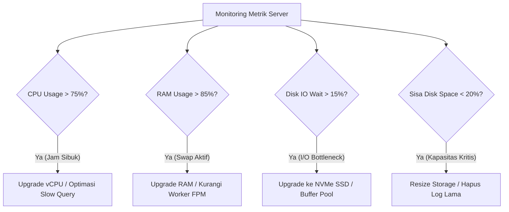

# Panduan Rekomendasi Spesifikasi Server & Standar Upgrade

Dokumen ini adalah acuan teknis dalam menentukan **kebutuhan spesifikasi hardware/server**, estimasi kapasitas operasional, serta **standar indikator metrik kapan infrastruktur server perlu di-upgrade** untuk **Sistem Kas Sederhana Multi-User (Laravel 12)**.

---

## 1. Matriks Rekomendasi Spesifikasi Berdasarkan Beban Kerja

| Kategori Beban Kerja | Profil Pengguna & Transaksi | Rekomendasi Lingkungan | CPU / vCPU | RAM | Tipe Storage & Kapasitas | Estimasi Biaya Bulanan |
|---|---|---|---|---|---|---|
| **Tier 1: Usaha Mikro & Kecil** *(Single Branch)* | • 1 - 5 Pengguna aktif<br>• < 1.000 transaksi/bulan<br>• 1 Admin, 2 Kasir | • Shared Hosting (cPanel)<br>• *atau* VPS Mini (Ubuntu/aaPanel) | 1 vCPU (2.0 GHz+) | 1 GB - 2 GB | 20 GB - 30 GB SSD / NVMe | Rp 30.000 - Rp 80.000 / bln |
| **Tier 2: Usaha Menengah** *(Multi-Kasir / 2-5 Cabang)* | • 5 - 25 Pengguna aktif<br>• 1.000 - 50.000 transaksi/bulan<br>• Generate laporan harian/mingguan | • VPS Mandiri (Ubuntu 24.04)<br>• *atau* VPS aaPanel LNMP | 2 vCPU (3.0 GHz+) | 4 GB | 50 GB - 80 GB NVMe SSD | Rp 150.000 - Rp 300.000 / bln |
| **Tier 3: Skala Besar / Korporasi** *(Multi-Cabang Nasional)* | • 25 - 100+ Pengguna bersamaan<br>• > 50.000 transaksi/bulan<br>• Export laporan besar, Queue email | • VPS High-Performance<br>• *atau* Cloud Dedicated (AWS / DO / Linode / IDCloudHost) | 4 - 8 vCPU | 8 GB - 16 GB | 100 GB - 200 GB NVMe SSD (RAID 10) | Rp 500.000 - Rp 1.500.000 / bln |

---

## 2. Rincian Kebutuhan Komponen Hardware

### 1. Memori (RAM)
- **Mengapa Penting:** Laravel 12 dengan PHP 8.3-FPM, MySQL InnoDB Buffer Pool, serta OPcache mengonsumsi RAM secara stabil.
- **Alokasi Ideal:**
  - OS & Nginx: ~300 MB
  - PHP-FPM Pools (10-20 workers): ~500 MB - 1.2 GB
  - MySQL Database (InnoDB Buffer): ~512 MB - 2 GB
  - Redis / Cache (jika digunakan): ~256 MB

### 2. Prosesor (CPU / vCPU)
- Laravel memiliki efisiensi kompilasi tinggi saat OPcache aktif.
- 1 vCPU modern (misal AMD EPYC atau Intel Xeon Cascade Lake) sanggup menangani **40–80 HTTP requests per detik** untuk aplikasi kas ini.

### 3. Tipe Storage (Penyimpanan)
- **Wajib menggunakan SSD atau NVMe**. Database relasional MySQL untuk transaksi keuangan sangat sensitif terhadap kecepatan IOPS (*Input/Output Operations Per Second*).
- Hindari HDD tradisional untuk server produksi.

---

## 3. Standar & Indikator Kapan Server WAJIB di-Upgrade

Lakukan monitoring berkala (via `htop`, Netdata, Grafana, atau bawaan aaPanel/cPanel). Server **harus segera di-upgrade** jika ditemukan salah satu kondisi berikut secara berturut-turut selama **3 hari atau saat jam sibuk**:



### 1. Indikator CPU (Processor Bottleneck)
- **Kondisi Kritis:** Rata-rata *CPU Utilization* berada di atas **75% - 80%** selama lebih dari 15 menit berturut-turut pada jam kerja normal.
- **Dampak:** Respon aplikasi melambat (*latency* halaman kas bertambah dari <200ms menjadi >1.500ms).
- **Tindakan:** Upgrade jumlah core vCPU (misal dari 1 core ke 2 core, atau 2 core ke 4 core).

### 2. Indikator Memori (RAM Bottleneck & OOM)
- **Kondisi Kritis:** Konsumsi RAM di atas **85%** dan sistem mulai sering menggunakan partisi **Swap Memory** (Swap I/O aktif).
- **Dampak:** MySQL service dapat tiba-tiba *Crash / Forced Kill* oleh kernel Linux (*Out-Of-Memory Killer*).
- **Tindakan:** Upgrade kapasitas RAM (misal dari 2 GB ke 4 GB).

### 3. Indikator Database & Disk I/O Bottleneck
- **Kondisi Kritis:** Nilai `%iowait` pada CPU di atas **15%**, atau proses query laporan kas memakan waktu lebih dari 3 detik.
- **Tindakan:** 
  1. Cek indexing database.
  2. Naikkan `innodb_buffer_pool_size` di MySQL.
  3. Pindahkan hosting ke provider yang menyediakan NVMe storage dengan IOPS lebih tinggi.

### 4. Indikator Kapasitas Penyimpanan (Disk Space)
- **Kondisi Kritis:** Sisa kapasitas penyimpanan kurang dari **20%** atau di bawah **5 GB**.
- **Tindakan:** Tambah volume disk (*Resize Disk Volume*) dan lakukan pembersihan file log lama (`storage/logs/laravel.log`).

---

## 4. Langkah Optimasi Sebelum Memutuskan Upgrade Hardware (Cost-Efficiency)

Sebelum mengeluarkan biaya tambahan untuk upgrade hardware, terapkan langkah-langkah optimasi software berikut:

1. **Aktifkan PHP OPcache**:
   Pastikan pada `php.ini` produksi:
   ```ini
   opcache.enable=1
   opcache.memory_consumption=128
   opcache.interned_strings_buffer=16
   opcache.max_accelerated_files=10000
   opcache.validate_timestamps=0
   ```
2. **Jalankan Perintah Optimasi Laravel**:
   ```bash
   php artisan config:cache
   php artisan route:cache
   php artisan view:cache
   composer install --optimize-autoloader --no-dev
   ```
3. **Gunakan Redis untuk Session & Cache (Jika RAM >= 2GB)**:
   Ubah di file `.env`:
   ```env
   CACHE_STORE=redis
   SESSION_DRIVER=redis
   QUEUE_CONNECTION=redis
   ```
4. **Pasang Cloudflare (CDN & Edge Caching)**:
   Gunakan Cloudflare gratis untuk men-cache seluruh file statis CSS, JS (TailAdmin build), dan aset gambar avatar sehingga server VPS hanya melayani request dinamis PHP.

---

## 5. Prosedur Standar (SOP) Upgrade Server Tanpa Downtime

Jika server berada pada layanan cloud VPS (DigitalOcean, AWS Lightsail, Linode, IDCloudHost, DomaiNesia, dll):

1. **Buat Snapshot / Backup Penuh**: Buat snapshot image server sebelum melakukan proses *resize*.
2. **Jadwalkan di Luar Jam Operasional**: Lakukan proses upgrade pada malam hari (misal pukul 23:00 - 05:00).
3. **Aktifkan Mode Maintenance**:
   ```bash
   php artisan down --secret="bypass-token-rahasia" --render="errors::503"
   ```
4. **Resize Instance VPS**: Ubah paket spesifikasi pada dashboard provider VPS (umumnya memerlukan waktu restart 1–3 menit).
5. **Verifikasi Service**:
   Pastikan Nginx, PHP-FPM, dan MySQL menyala otomatis setelah reboot:
   ```bash
   systemctl status nginx php8.3-fpm mysql
   ```
6. **Nonaktifkan Mode Maintenance**:
   ```bash
   php artisan up
   ```
